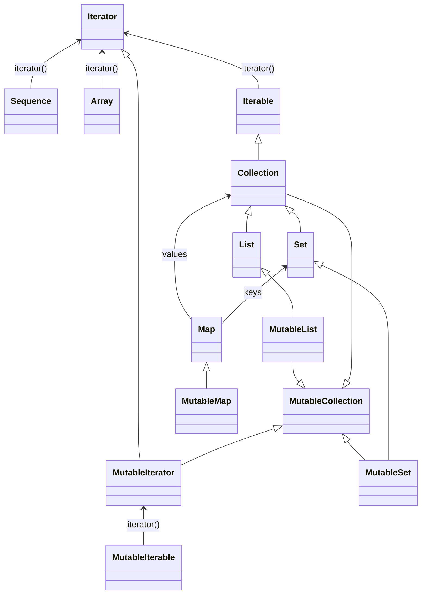

# Collection
- 자바에 비해 조금 더 풍부한 컬렉션 기능을 제공한다.

## 컬렉션 타입
- 기본적으로 네 가지로 분류할 수 있다.
  1. Array
  2. Iterable
  3. Sequence
  4. Map
- 배열과 비슷하게 컬렉션 타입도 제네릭 타입이다.



### 이터러블
- `Iterable<T>` 타입으로 표현되며, 일반적으로 즉시 계산되는 상태가 있는 컬렉션을 표현한다.
- 상태가 있다는 말은 컬렉션이 원소를 필요로 할 때 생성하는 제네레이터 함수를 유지하지 않고 원소를 저장한다는 것이다.
- 즉시 계산은 어느 시점에 필요한 원소를 초기화하는 것이 아니라 컬렉션 생성시 초기화된다는 것이다.
- Java의 Iterable과 상당히 유사하다.

> vs.Java
> - 코틀린의 Iterator는 자바와 동일하다.
> - hasNext, next 메소드가 있다.
> - 유일하게 remove가 없다는 게 차이점이다. 이는 MutableIterator로 옮겨졌다.
> - 코틀린의 특징은 불변, 가변 컬렉션을 구분한다는 것이다.


### Collection, List, Set

- 이터러블 하위 분류 중 Collection 인터페이스로 표현되는 타입들과 Collection 타입의 하위 타입인 MutableCollection 인터페이스로 표현되는 것이 있다.
  1. List/MutableList: 
     - 인덱스를 통한 원소 접근이 가능한, 순서가 정해진 원소의 컬렉션이다.
     - 일반적으로 index를 통한 임의 접근이 가능한 ArrayList와 원소 끝 쪽에 요소를 추가하거나 삭제할 수 있다.
     - 인덱스로 원소 접근시 선형시간이 걸린다.
  2. Set
     - HashSet은 해시 테이블이 기반인 구현이며, 원소의 해시코드에 따라 원소 순서가 정해진다. `hashCode()`에 따라 구현이 달라진다.
     - LinkedHashSet은 해시 테이블 + 삽입 순서를 유지하므로 순회하면 삽입 순서로 순회할 수 있다.
     - TreeSet은 binarySearchTree 기반이며, 어떤 비교 규칙에 따라 일관성 있는 원소 순서를 제공한다.

> vs. Java
> - java.util에 있는 것이 아닌 `kotlin.collections` 패키지에 위치해 있는 것을 사용하면 된다.
> - `kotlin.collections`으로 별명을 통해서  ArrayList 같은 표준 컬렉션을 사용할 수 있다.
> 

### Sequence
- sequence도 iterator()를 제공한다.
- 이 메소드로 시퀀스의 내용을 순회할 수 있다.
- 시퀀스는 지연 계산을 가정하기 때문에 `iterator()`의 의도가 이터러블과 다르다.
- 대부분의 시퀀스 구현은 객체 초기화 시 원소를 초기하지 않고 요청에 따라 원소를 계산한다.
- 대부분의 시퀀스 구현은 상태가 없다.
- 지연 계산된 컬렉션 원소 중에서 정해진 개수의 원소만 저장한다는 뜻이다.
- iterable과 달리 sequence 구현은 내부적이므로 외부에서 직접사용할 수 없다.

> vs.Java
> - java 1.8의 stream이랑 유사하다.
> - kotlin1.2부터 asSequence()로 확장함수를 제공한다.
> - 자바 스트림을 래핑해서 코틀린 시퀀스로 사용하게 해준다.

### Map
- Key:Value로 이뤄진 딕셔너리다.
- Key는 유일하게 취급된다.
- Collection 타입은 아니지만 내부 원소들을 컬렉션처럼 사용할 수 있다. 
- HashMap, LinkedHashMap, TreeMap이 있다.

## Comparable, Comparator
- 자바처럼 코틀린도 Comparable, Comparator를 지원한다.
- 비교 가능 인스턴스는 자연적 순서를 지원한다.
- 이런 타입의 인스턴스들은 모두 동일한 타입의 다른 인스턴스와 순서를 비교할 때 `compareTo()`를 포함한다.
- Comparable을 상속하면 자동으로 `>`, `<`를 연산으로 쓸 수 있다.

## 컬렉션 생성
- Java와 마찬가지로 ArrayList, LinkedHashSet 같은 클래스 인스턴스를 생성자로 호출할 수 있다.

```kotlin
import java.util.TreeMap

val list = ArrayList<String>()
list.add("red")
list.add("blue")

val setExample = HashSet<Int>()
setExample.add(12)
setExample.add(21)

val map = TreeMap<Int, String>()
map[10] = "TEN"
```

- arrayOf()와 비슷하게 가변 길이 인자를 받는 함수를 사용해서 몇몇 컬렉션 클래스의 인스턴스를 생성할 수 있다.
  1. `emptyList()`/`emptySet()`: 불변인 빈 리스트/ 집합
  2. `listOf()`/`setOf()`: 인자로 제공한 배열에 기반한 불변 리스트/집합을 만든다.
  3. `listOfNotNull()` : Null인 요소를 걸러내고 남은 원소들로 이뤄진 새 불변 리스트를 만든다.
  4. `mutableListOf()`/`mutableSetOf()` : 가변인 리스트/집합
  5. `arrayListOf()`: 새로운 ArrayList를 생성
  6. `hashSetOf()`/`linkedSetOf()`/`sortedSetOf()`
- map도 비슷하게 있다.
  1. `emptyMap()`: 빈 불변 맵
  2. `mapOf()`: 불변 맵(LinkedHashMap)
  3. `mutableMapOf()` : 가변 맵(LinkedHashMap)
  4. `hashMapOf()`/ `linkedMapOf()`/ `sortedMapOf()`: hashMap/ LinkedHashMap/ TreeMap을 만든다.

- 맵은 Pair 객체들로 이뤄진 가변 인자를 받는다.
- to 중위 연산자를 사용하면 `Pair`를 만들 수 있다.
```kotlin
val emptyMap = emptyMap<Int,String>()
//emptyMap[10] = "TEN" //Unresolved reference.

val singletonMap = mapOf(10 to "TEN")
val mutableMap = mutableMapOf(10 to "TEN")

//이게 아니면 전통적인 방법으로
mutableMap.set(20, "Twenty")

//혹은
mutableMap[30] = "Thirty"

```

- 시퀀스를 만드는 가장 단순한 방법은 `sequenceOf()`를 사용하는 것이다.
- 이 함수는 가변 인자를 받는다. 또는 배열, 이터러블, 맵 등의 기존 컬렉션 객체에 대해서 asSequence()를 호출해서 얻을 수 있다.
````kotlin
println(sequenceOf(1, 2, 3).iterator().next())
println(listOf(1, 2, 3, ).asSequence().iterator().next())
````
- 맵에서 호출하면 Map.Entry 타입의 시퀀스를 얻는다.
- `generateSequence()`로 함수를 사용해서 시퀀스를 만들 수도 있다.
```kotlin
val numbers = generateSequence { readLine()?.toIntOrNull() }
val powers = generateSequence(1) { it * 2 }
```
- 1.3부터 특별한 빌더를 사용해서 시퀀스를 만들 수 있다.
- 이때 빌더는 시퀀스 원소를 부분부분 지정한다. 
- SequenceScope가 수신 객체 타입인 확장 람다를 받는 sequence() 함수를 통해서 빌더를 구현할 수 있다.
  1. yield(): 원소를 하나 시퀀스에 추가
  2. yieldAll(): 지정한 iterator, iterable, sequence에 있는 모든 원소를 시퀀스에 추가한다.
- 원소가 지연 계산된다.
```kotlin
val numbers = sequence { 
    yield(0)
    yieldAll(listOf(1, 2, 3))
    yieldAll(intArrayOf(1, 2, 3).iterator())
    yieldAll(generateSequence(10) { if ( it < 50 ) it*3 else null  })
}
println(numbers.toList())
```
- sequence(), yield, yieldAll로 만들어진 시퀀스 빌더는 실제로 유예 계산(suspendable computation)이라는 코틀린 기능의 예다.
- 컬렉션 사이의 변환을 처리하는 함수도 있다. 배열 원소를 바탕으로 리스트를 만들거나 시퀀스를 집합으로 만들 수 있다. 
```kotlin
println(
    listOf(1, 4, 3, 2, 3).toSet()
) //1, 2, 3, 4

println(
    arrayOf("red", "green", "blue").toSortedSet()
) //blue, green, red

println(
    mapOf(1 to "one", 2 to "two", 3 to "three").toList()
)//[(1, one), (2, two), (3, three)]
```


## 기본 연산
- 모든 컬렉션이 기본으로 지원하는 연산으로는 `iteration()`이 있다.
- `iterator`가 있으면 for-loop를 사용할 수 있다.
- map의 iterator는 Map.Entry로 뱉는다.
- 코틀린 맵 원소는 구조 분해를 지원한다.
```kotlin
val map = mapOf(1 to "one", 2 to "two", 3 to "three")
for( (key, value) in map) {
    println("$key: $value")
}
```

- Java와 같이 forEach가 있고 인덱스도 필요하다면 `forEachIndexed()`를 사용하면 된다.
- 기본 연산자로는
  1. size()
  2. isEmpty()
  3. contains()/ containsAll()
- mutable은 아래와 같다.
  1. add()  -> (`list += 4`)
  2. remove()  -> (`list -= 4`)
  3. addAll()  -> (`list += setOf(5, 6)`)
  4. removeAll() ->  (`list -= listOf(5, 6)`)
  5. retainAll()
  6. clear()
- 배열처럼 index로 접근할 수 있다. `list[1]`
- 가변리스트/맵이라면 배열과 같이 값을 추가할 수도 있다.

## 원소 접근
- 개별 원소에 접근을 편하게 해주는 확장 함수들이 있다.
- first(), last() 등이 예다.
- firstOrNull(), lastOrNull도 있다.
- 위 메소드는 주어진 조건을 만족하는 첫, 마지막을 찾기위해서 trailingClosure를 넘길 수도 있다.
```kotlin
val list = listOf(1,2,3,)
list.first { it > 2 }
list.lastOrNull { it > 2 }
```

- single()은 싱글톤 컬렉션의 원소를 반환한다. 원소가 두 개 이상이면 예외를 던진다.
- singleOrNull()이 있다. 예외 대신 Null을 반환한다.
- elementAt()으로 인덱스로 컬렉션 원소를 읽을 수도 있다. 이 함수는 random access list가 아닌 컬렉션에 사용하면 O(n)의 실행 시간이 걸린다.
- elementAtOrNull()은 더 안전한 버전이다. 인덱스를 벗어난 경우 null을 뱉는다.
- elementAtOrElse()로 실패한 경우 지정한 원소를 반환케 할수도 있다.

```kotlin
val list = listOf(1, 2, 3)
list.elementAtOrNull(1)
list.elementAtOrElse(1) { Int.MAX_VALUE }
list.elementAt(2)
```

- 구조분해할당으로 최대 다섯개의 원소를 추출할 수도 있다.
````kotlin
val list = listOf(1, 2, 3, 4, 5, 6)
val (a, b, c, d ) = list
//없는 인덱스까지 가져오려고 하면 java.lang.IndexOutOfBoundsException
````

## 컬렉션 조건 검사
- all: 모든 원소가 주어진 술어를 만족하면 true를 반환한다.
```kotlin
println(listOf(1, 2, 3, 4).all { it < 10 })
```

- none: all과 반대다. 하나도 만족하지 않으면 true를 반환한다.
```kotlin
println(listOf(1, 2, 3, 4).none { it < 10 })
```

- any: 하나라도 만족하면 true
```kotlin
print(listOf(1, 2, 3, 4).any { it < 10 })
```

- 빈 컬렉션의 경우, all(),none()은 true, any()는 false를 뱉는다. 드모르간 법칙을 사용하면 아래와 같다.
- `c.all{ p(it) } == c.none { !p(it) }`
- `c.none{ p(it) } == !c.any { p(it) }`

## 집계
컬렉션 원소의 합을 계산하거나 최대 값을 찾는 것 같이 한 값을 계산해내는 경우
- count() : 컬렉션 원소 개수를 반환한다. 추가적으로 술어를 적용하는 오버로딩된 버전이 있다.
```kotlin
mapOf(1 to "I", 5 to "V", 10 to "X").count{ it.key == 1 }
```
- sum()/sumOf(): 원소 타입이 수라면 합을 구할 수 있다. 추가적으로 of가 붙은 함수는 trailingClosure로 숫자로 변경해서 합을 구할 수 있다.
- average() : 평균을 구한다 리턴은 항상 Double이다. 컬렉션이 비어있으면 `Double.NaN`을 리턴한다.
- minOrNull()/maxOrNull() : 최소, 최대를 뱉는다.
- minByOrNull()/maxByOrNull : trailingClosure로 수로 변경해서 최대/최소를 구한다.
- joinToString : 컬렉션 원소를 문자열로 엮는 일을 담당한다.
  - separator: 구분자
  - prefix/postfix: 결과 앞 뒤로 들어갈 문자열을 지정한다.(기본 \"\")
  - limit: 최대로 보여줄 수 있는 원소 개수
  - truncated: limit이 양수인 경우 + 너무 길어줄 경우 이 파라미터 값을 뒤에 추가 (기본 ...)
- joinTo: 더 일반적인 함수를 제공한다. 
- fold()/reduce : 두 값을 조합하는 함수이다.
  1. reduce: 누적 계산을 하는데 사용한다. 컬렉션이 비어있으면 예외를 던진다.
  2. reduceIndexed: reduce에 인덱스가 필욯면 사용하면 된다.
  3. fold: 누적 값의 초기 값을 원하는대로 지정하고 싶으면 사용하면 된다. reduce와 이외는 다 비슷하다.
  4. foldIndexed : fold + 인덱스


## 걸러내기
- 조건에 만족하지 않은 경우를 걸러낼 수 있다. 
- 기본적으로 filter()를 제공한다.
- 이 함수에 전달되는 술어를 바탕으로 true면 유지하고 false면 걸러낸다.
```kotlin
println(listOf("red", "green", "blue", "green").filter { it.length > 3 })
```
- map의 경우 술어 파라미터가 Map.Entry를 인자로 받는다. 
- 키나 값만 걸러내고 싶다면 `filterKeys()`나 `filtervalues()`를 사용하면 된다.
- `filterNot()`은 함수 조건을 부정해 걸러낼 수 있게 해주나.
- `filterKeys()`, `filterValues()`, `filterNot()`의 부정은 없다. 
- `filterIndexed()`도 있다.
- 일반적으로 구현된 `filterNotNull()` 같은 경우도 있다.
- 또 일바적으로 특정 타입만 남기는 경우 `filterIsInstance()`도 있다.
```kotlin
val numbers = listOf("1", 1, "2", 2, "3", 3)
println(numbers.filterIsInstance<Int>())
```
- 지금까지 걸러내기 함수들은 호출될 때마다 불변 컬렉션을 만든다.
- 가변 컬렉션으로 넘기고 싶다면 ~To로 된 메소드에 가변 컬렉션을 파라미터로 넣으면 된다.
- 추가로 원래 컬렉션을 주어지 술어로 만족하는 부분 컬렉션과 만족하지 않는 부분을 쌍으로 만들어주는 `partition()`이라는 함수를 제공한다.
```kotlin
val (evens, odds) = listOf(1, 2, 3, 4, 5).partition { it % 2 == 0 }

// Map은 제공하지 않는다.
```

## 변환
- 주어진 규칙에 따라 변경하고, 이를 정해진 방식으로 조합해서 새로운 컬렉션으 반들어내는 것.
  1. 컬렉션에 원소의 함수를 정용하고 뱉는 방법
     - map : 컬렉션의 각 원소에 함수를 적용하고 뱉는다.
     - mapIndexed : map과 인덱스가 필요한 경우 사용한다.
     - mapNotNull
     - mapIndexedNotNull
     - mapKeys
     - mapValues
  2. 평평하게 하는 연산
     - flatMap
  3. 연관짓는 연산
    - associateWith: 원소를 map의 key로 두고 함수 결과를 value로 뱉는, map을 만드는 연산
    - associateBy : 원소를 map의 value로 두고 함수 결과를 key으로 뱉는, map을 만드는 연산
    - associate : 컬렉션의 원소로 key, value를 만든다.
```kotlin
println(listOf("red", "blue", "green".associateBy { it.length }))
//{3=red, 4=blue, 5=green}
println(listOf("red", "blue", "green").associateWith { it.length })
//{red=3, blue=4, green=5}
println(listOf("red", "blue", "green").associate{ it.uppercase() to it.length})
//{RED=3, BLUE=4, GREEN=5}
```

## 하위 컬렉션 추출
- 리스트의 경우 slice()는 subList()와 비슷하며, 원 컬렉션을 반영할 수 있는 래퍼 객체를 만들어낸다.
- 배열 원소를 다른 배열로 추출하고 싶다면 `siceArray()`를 써야 한다.
```kotlin
val slice = Array(6) { it * it * it }.sliceArray(2..4).contentToString()

/**
 * 정수 이터러블을 인자로 받아서 선택할 원소의 인덱스를 결정하는 slice()/sliceArray()를 더 일반화한 버전이 있다.
 * 이 버전을 사용하면 원본 배열이나 리스트의 임의의 하위 시퀀스를 추출할 수 있다.
 */
println(List(6) { it * it}.slice(listOf(1, 2, 3)))
println(List(6) { it * it}.slice(setOf(1, 2, 3)))
```
- take(), takeLast()는 iterable이나 배열에서 원소를 주어진 개수만큼 추출한다. take()는 앞에서부터 takeLast()는 뒤에서부터다.
```kotlin
println(List(6){ it*it }.take(2))
println(List(6){ it*it }.takeLast(2))
```

- drop(), dropLast()는 take()/takeLast()를 반전시킨 연산이라고 생각할 수 있다. 주어진 개수만큼 원소를 제거한 나머지 원소들을 돌려준다.
```kotlin
println(List(6){ it*it }.drop(2))
println(List(6){ it*it }.dropLast(2))
```

- take, drop에 술어를 받는 버전이 있다. ~while이 붙은 함수들이다.
```kotlin
println(List(6){ it*it }.takeWhile { it < 10 })
println(List(6){ it*it }.takeLastWhile { it < 10 })
println(List(6){ it*it }.dropWhile { it < 10 })
println(List(6){ it*it }.dropLastWhile { it < 10 })
```

- 코틀린 1.2에 추가된 chunked()는 iterable이나 sequence를 주어진 개수를 넘지 않는 작은 list로 청크 단위로 나눠준다.
```kotlin
val list = List(10) {it * it}
println(list.chunked(3))
```

- 1.2에 도입된 windowed() 함수를 사용하면 일정한 간격으로 청크를 연속적으로 얻어낸 슬라이딩 윈도우를 얻을 수 있다. chunked와 마찬가지로 windowed도 이터러블에서는 리스트를 만들고 시퀀스에서는 리스크의 시퀀스를 만든다.
```kotlin
val list = List(6) { it * it}
//0, 1, 4, 9, 16, 25
println(list.windowed(3))
//[[0, 1, 4], [1, 4, 9],  [4, 9, 16], [9, 16, 25]]

/**
 * step: 서로 인접한 윈도우의 첫번째 원소 사이의 거리(default 1)
 * partialWindows : 컬렉션의 마지막 부분에서 지정한 위도우 크기보다 작은 크기의 윈도우를 포함시킬지 여부
 */
```

## 순서
- 표준 라이브러리에는 정렬하는 함수가 들어있다.
- 가장 간단한 형태는 sorted()
- sortedDescending()은 내림차순으로 정렬한다.
```kotlin
println(intArrayOf(5, 8, 1, 4, 2).sorted())
println(intArrayOf(5, 8, 1, 4, 2).sortedDescending())
```
- 컬렉션 원소가 비교 가능하지 않아도 순서를 제공함으로써 sorted()를 대체할 수 있는 sortedBy(), sortedWith()으로 정렬할 수도 있다.

```kotlin
class Person(val firstName: String, val familyName: String, val age: Int) {
    override fun toString(): String = "$firstName, $familyName, $age"
}

val Person.fullName get() = "$firstName $familyName"
val Person.reverseFullName get() = "$familyName $firstName"

val FULL_NAME_COMPATOR = Comparator<Person> { p1, p2 -> p1.fullName.compareTo(p2.fullName) }
val REVERSE_FULL_NAME_COMPARATOR = Comparator<Person>{ p1, p2 -> p1.reverseFullName.compareTo(p2.fullName) }

main() {
    val persons = listOf(
        Person("A", "familyA", 10),
        Person("B", "familyB", 20),
        Person("C", "familyC", 30),
        Person("D", "familyD", 40)
    )
    
    print(persons.sortedWith(FULL_NAME_COMPATOR))
    print(persons.sortedWith(REVERSE_FULL_NAME_COMPARATOR))
    print(persons.sortedBy { it.age })
    print(persons.sortedByDescending { it.age })
}
```
- 모두 원본을 두고 새로운 컬렉션을 반환한다.
- 배열이나 가변 List의 경우에는 원본 컬렉션을 변경할 수 있으므로 제자리 정렬을 수행할 수 있다. sort(), sortDescending()은 제자리 정렬을 수행한다.
```kotlin
val array = intArrayOf(4, 0, 9, 2, 8).apply { sort() }
println(intArrayOf(1, 2, 3, 4, 5).reversed())
```
- 배열의 경우 reversedArray()를 사용할 수 있다. 배열 대신 리스트를 반환한다.
- 제저리에서 가변 리스트나 배열 원소를 뒤집을 떄는 reverse(), sort()를 쓸 수 있다.
```kotlin
val array = intArrayOf(1, 2, 3, 4, 5, 6).apply { reverse() }.contentToString()
```
- shuffled는 원본의 원소를 임의의 순서로 재배치한 새 리스트를 돌려준다.
```kotlin
println(listOf(1, 2, 3, 4, 5).shuffled())
```