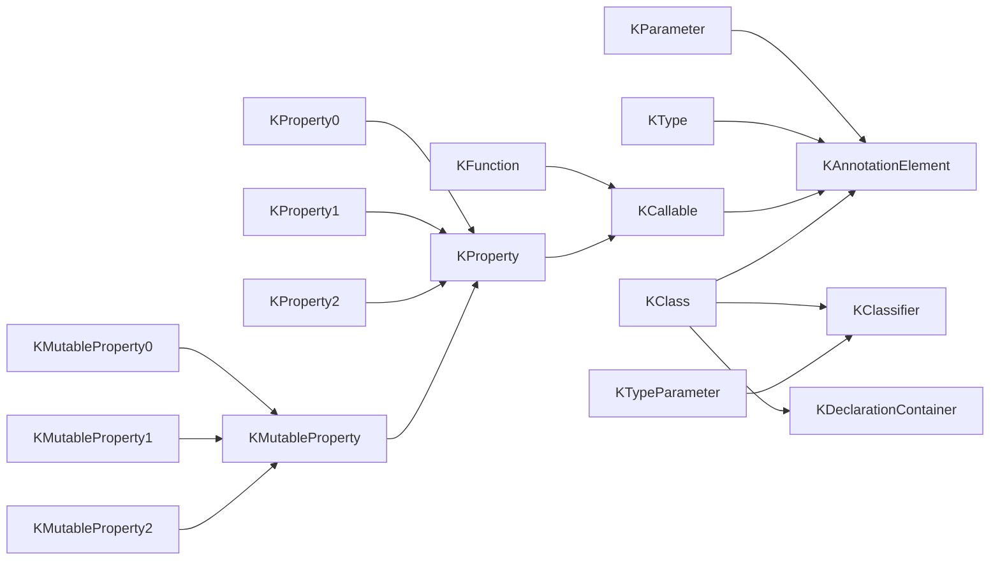

# Reflection
- 리플렉션은 클라스, 함수, 프로퍼티의 런타임 표현에 접근할 수 있게 해주는 타입, 함수, 프로퍼티 모음이다.

> vs.Java
> - 코틀린 리플렉션 자체로는 완결성이 없다.
> - 클래스 검색, 적재 등은 자바 ReflectionAPI를 사용해야 한다.
> - 코틀린 관련 측면은 kotlin ReflectionAPI로 코틀린 답게 사용할 수 있다.

## 1. 개요



- 모든 Reflection은 `KAnnotationElement`의 자손
- `KAnnotatedElement`는 함수, 프로퍼티, 클래스 등 구체적인 언어 요소에 정의된 어노테이션에 접근하는 기능을 제공

```kotlin
import kotlin.reflect.KClass

annotation class Dependency(vararg val componentClasses: KClass<*>)
annotation class Component(
    val name: String = "Core",
    val dependency: Dependency = Dependency()
)

@Component("I/O")
class IO

@Component("Log", Dependency(IO::class))
class Logger

@Component(dependency = Dependency(IO::class, Logger::class))
class Main


fun main() {
    val component = Main::class.annotations
                               .filterIsInstance<Component>()
                               .firstOrNull() ?: return
    
    
    println("component name: ${component.name}")
    
    val depText = component.dependency.componentClasses.joinToString { it.simpleName ?: "" }
}
```

## 지정자와 타입
- 지정자는 타입을 정의하는 선언을 뜻한다.
- 이런 선언은 `KClassifier` 인터페이스에 의해 표현된다.
- 이 인터페이스는 두 가지 변종이 있다.
  1. `KClass<T>` 컴파일 시점에 T 타입인 클래스나 인터페이스, 객체 선언을 런타임에 표현
  2. KTypeParameter는 어떤 제네릭 선언의 타입 파라미터를 표현한다.
- 참고로 typeAlias에는 relfection 표현법이 없다. 향후 추가 예정이다.

- KClass를 얻는 방법은 두 가지다.
  1. 클래스 리터럴(`~::class`)
  ```kotlin
    inline fun<reified T> Any.cast() = this as? T
    //kotlin의 구체화는 타입 파라미터 정보를 런타임까지 유지할 수 있는 방법 (reified)
    val obj: Any = "Hello"
    print(obj.cast<String>())
  ```
  2. kotlin 확장 프로퍼티를 사용해서 `java.lang.Class`의 인스턴스를 KClass로 변환하는 것이다.
  ```kotlin
    //kotlin reflection은 클래스를 검색하는 API가 없다.
    //그래서 적절한 클래스 검색 방식을 사용해야 한다.
    val stringClass = Class.forName("java.lang.String").kotlin
    print(stringClass.isInstance("Hello"))
  
    //반대 변환도 가능하다.
    println(String::class.java)
  ```
  
> ### KClass API
> - val isAbstract: Boolean
> - val isCompanion: Boolean
> - val isData: Boolean
> - val isFinal: Boolean
> - val isInner: Boolean
> - val isOpen: Boolean
> - val isSealed: Boolean

- 이 그룹에 속한 `visibility`는 `KVisibility` enum으로 클래스 선언의 가시성 수준을 돌려준다.
```kotlin
enum class Kvisibility {
    PUBLIC,
    PROTECTED,
    INTERNAL,
    PRIVATE
}
```

- 가시성 표현이 불가하면 null이다.

- `val simpleName: String?`은 소스코드에서 사용되는 간단한 이름을 반환한다. 이름이 없다면 null이다.
- `val qualifiedName: String?`은 클래스의 전체 이름을 얻을 수 있다. 전체 이름은 클래스가 포함된 패키기 전체 경로가 들어간다.

- `jvmName` 확장 프로퍼티를 사용하면 자바 관점에서 클래스 전체 이름을 돌려준다.
- 일부 내장 코틀린 타입은 상응하는 JVM 표현이 없고 자바 클래스에만 의존하는 경우가 있다.

```kotlin
import kotlin.reflect.jvm.jvmName

println(Any::class.qualifiedName)//kotlin.Any
println(Any::class.jvmName)//java.lang.Object
```
- `isInstance()`는 주어진 객체가 이 함수의 수신 객체가 표현하는 클래스의 인스턴스인지 알려준다.
- nonNull인 타입에 대해서 `is` 연산자와 비슷하게 작동한다.

> - constructor: 주 생성자, 부 생성자들을 KFunction 타입의 인스턴스로 돌려준다.
> - members: KCallable 인스턴스로 표현되는 멤버 함수와 프로퍼티 표현의 컬렉션을 돌려준다. 컬렉션 안에는 상위 타입에서 상속한 모든 멤버를 포함한다.
> - nestedClasses: 내포된 클래스와 객체들로 이뤄진 클래스다. 
> - typeParameter: KTypeParameter에 의해 표현되는 타입 파라미터로 이뤄진 리스트다.(대상이 Generic이 아니면 비어있다.)
> - 실제 인스턴스를 얻고 싶으면 `objectInstance`를 사용해야 한다.
> 
> ```kotlin
> object O {
>   val text = "Singleton" 
> }
> 
> fun main() {
>   println(O::class.objectInstance!!.text) //Singleton
> }
> ```
>
- sealedSubclasses 프로퍼티로 직접적인 상속자로 이뤄진 리스트를 얻을 수 있다.
- KClass에서 얻을 수 있는 다른 정보로 `supertypes`로 KType의 인스턴스 리스트를 들 수 있다.
- `supertype` 프로퍼티는 직접 상속한 상위 타입만 돌려준다.
- 따라서 간접적 상위 클래스도 모두 포함하려면 별도의 상속 그래프 순회를 수행해야 한다.
- `KClassifier`의 변종 중 KClass 외의 것으로 KTypeParameter 인스턴스로 표현되는 정보가 있다.
> - `val isReified: Boolean`
> - `val name: String`
> - `val upperBounds: List<KType>` : 상위 바운드 타입으로 이뤄진 리스트
> - `val variance: KVariance`: KVariance 이넘으로 변성을 돌려준다. `enum class KVariance { INVARIANT, IN, OUT }`

- KType 인터페이스로 타입 표현은 아래 세 가지 성격을 지닌다.
  1. isMarkedNullable (List<String>, List<String>?를 구분할 수 있다.)
  2. classifier: 프로퍼티를 통해 제공하는 지정자 (List<String> -> List) 
  3. Type Property에 전달된 실제 타입 인자 목록 (List<String> -> String)


## 호출 가능
### 1. KCallable
- callable 요소라는 개념은 어떤 결과를 얻기 위해서 호출할 수 있는 함수나 프로퍼티를 함께 묶어준다.
- `KCallable<out R>`이라는 제네릭 인터페이스를 통해서 호출 가능 요소로 표현한다.
- `KCallable`이 제공하는 멤버는 아래와 같다.
> - `val isAbstract: Boolean`
> - `val isFinal: Boolean`
> - `val isOpen: Boolean`
> - `val isSuspend: Boolean`: 일시 중단 가능한 계산(Suspendable computation)을 지원하는 호출 가능 객체에서 사용된다.
> - `val visibility: KVisibility?`
- 프로퍼티나 함수의 시그니쳐를 표현하는 프로퍼티가 속한 그룹은 아래와 같다.
> - `val name: String`
> - `val typeParameters: List<KTypeParameter>`
> - `val parameters: List<KParameter>`
> - `val returnType: KType`
- KParameter 인터페이스는 멤버 및 확장 선언의 수신 객체나 함수/생성자의 파라미터에 대한 정보를 포함한다.
> - `val index: Int`
> - `val isOptional: Boolean`
> - `val isVararg: Boolean`
> - `val name: String?`
> - `val type: KType`
> - `val kind: KParameter`: KParmater가 일반적인 값에 해당하는지 아니면 디스패치나 확장의 수신 객체인지 알려준다. KParameter.Kind enum은 아래와 같다.
>   1. INSTANCE: 멤버 선언의 디스패치 수신 객체
>   2. EXTENSION_RECEIVER: 확장 선언의 확장 수신 객체
>   3. VALUE: 일반적인 값

- 또한 호출 가능한 선언을 동적으로 호출할 수 있게 해주는 invoke와 유사한 `call()`이 있다.
```kotlin
fun call( vararg args: Any? ): R
```
- 다른 호출 방법으로 callBy()가 있다.
```kotlin
fun callBy( args: Map<KParameter, Any?>: R )
```
- 더 구체적 호출 가능 요소로 KProperty 인터페이스는 프로퍼티에만 있는 변경자는 검사하는 프로퍼티를 추가로 제공한다.
> - `val isConst: Boolean`
> - `val isLateinit: Boolean`

### 2. KFunction
- 함수나 생성자를 표현한다.
- 이 인터페이스에 추가된 멤버는 모두 함수에 적용 가능한 변경자 검사를 위한 프로퍼티들 뿐이다.
> - `val isInfix: Boolean`: 연산자 함수와 관련이 있다.
> - `val isInline: Boolean`: 연산자 함수와 관련이 있다.
> - `val isOperator: Boolean`
> - `val isSuspend: Boolean`

- KFunction 자체는 다양한 인자 개수를 지원해야 하므로 어떤 함수 타입도 상속하지 않는다.
- 더 구체적인 KFunction의 하위 타입을 통해 구현될 수 있다.

```kotlin
import kotlin.reflect.KFunction2

fun combine(n: Int, s: String) = "$n$s"
fun main() {
    val f: KFunction2<Int, String, String> = ::combine
    println(f(1, "2"))
}
```